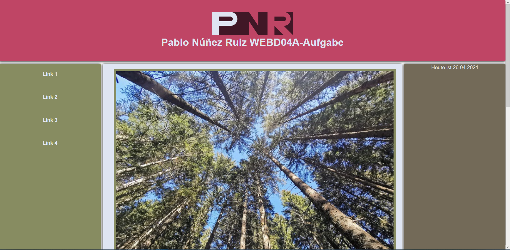

#Objectives:

    1-Page structure with sensibly used semantic markup using the semantic elements 
      (main, header, nav, footer, section, article, aside). 
      Fictitious navigation in nav with "dummy links". 
      Also add a picture with caption (figure / figcaption).

    2-A form that contains the following elements with the specified properties: 
        - search field (with autofocus)
        - text input, e.g. B. for names (with a placeholder that is set to your name) 
        - a "slider", a "spinbox" and a datalist field.

    3-A canvas element in which your initials are drawn using the appropriate script commands 
    (the convenient canvas function fillText for creating text must therefore expressly not be used here!). 
      Please use width = "350" and height = "100" as the dimensions of the canvas element.

    4-Integration of the short video clip “U-Bahn” as a native video in the site.   
      Please use width = "450" and height = "337" as the dimensions of the video element.

    -Design and layout of the page with CSS is optional and left to individual taste (CSS is not counted for the grade). 
     If CSS is used, the code should be stored in the boilerplate file provided in the css subfolder. 
     So you shouldn't add your own CSS file, but use the file intended for this by Boilerplate.