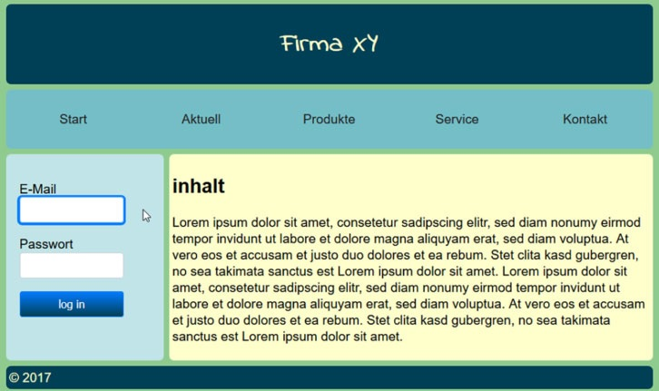

#Objectives:

    -Create a layout with the basic breakdown shown in the screenshot.

    -Please complete your information in the external stylesheet ea.css.
    -Define the basic layout using the grid layout.
    -Use Flexbox, however, to arrange the navigation points.
    -Define a web font for the heading h1 and use Google Fonts.
    -You will also find a small form in the template.
        • Define rounded corners for the normal state of the input fields.
        • The input elements should receive a shadow and a different border color 
          when you click on them.
        • So that the change does not take place so abruptly, please define a transition.
    
    -There is also a send button (log in) in the form:
        <input type = "submit" value = "log in">
            • Select the send button using the appropriate CSS3 selector.
            • Define the following formatting for the send button:
            • a different text color
            • a discrete color gradient
            • a frame color.