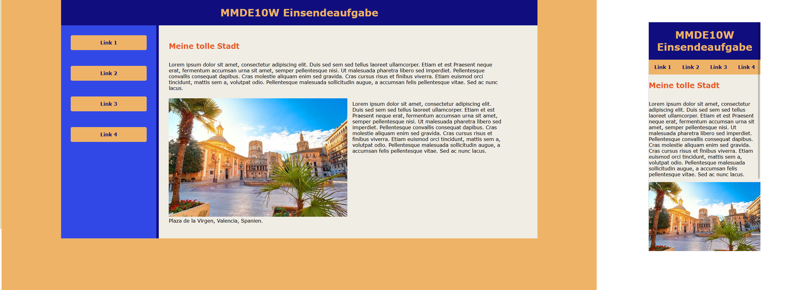

#Objectives:
  
  
    -Please follow the mobile-first principle and create a website 
     with a simple one-column layout, without footer and aside.

    -With regard to the design details (colors, fonts, proportions) 
     you can let your creativity run free. 
     However, the mobile layout must have the following properties:
        • external stylesheet mystyles.css
        • Header with heading
        • horizontal navigation bar (design of your choice)
        • An image must be included in the main content. 
          It should behave like Fluid Images (you can use any image 
          of your choice, but the original width of the image 
          should not be more than 500px).